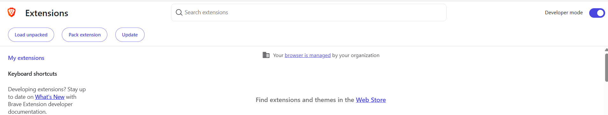
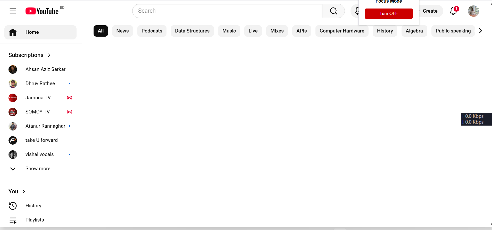

# Youtube-Focus-Mode
A chromium based browser extension to block youtube home feed and side bar 

## SETUP
1.Download the project folder or git clone to your machine  
2.Open Your Browser  
3.Go to Extension Manager   
4.Enable Developer Mode  
  
5.Click on Load Unpacked  
6.Give the Location of the folder  
7.Now go to Extensions and Open Youtube Focus Mode  
8. Click on turn on thats it  
  
